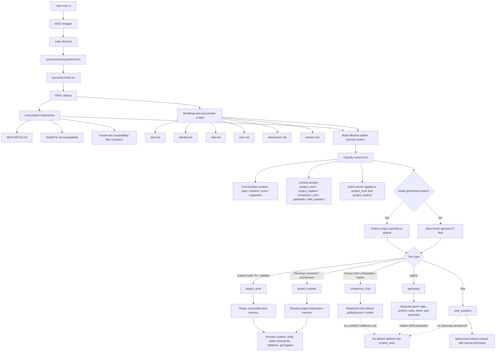

# SeaTurtle Architecture

This doc is the durable architecture map for the current SeaTurtle stack.

It is meant to show the major runtime layers and the newer CT architectural
additions without forcing a reader to reconstruct them from state notes or
source spelunking.

## Runtime And Context Architecture

## Current Architecture Truths

- `SEATURTLE.md` is the preferred shared project instruction file.
- `AGENTS.md` is read as a compatibility project-instructions file.
- The private `.ct/` stack is layered:
  1. soul
  2. identity
  3. role
  4. user
  5. attunement
  6. session
- Turn-level posture is applied lightly after those deeper layers.
- Git-root is the first heuristic for protecting project sanctity.
- `/btw` and `/game` are intentionally richer because they are separated from
  project-working memory instead of blended into it.
- Intent is treated separately from transcript memory so SeaTurtle can check
  whether a solution fits what the user actually meant.

## Related Docs

- [`README.md`](../README.md)
- [`docs/FEATURES-ROUTER.md`](./FEATURES-ROUTER.md)
- [`docs/BRANDING.md`](./BRANDING.md)
- [`docs/internal/CT-CONTEXT-DOMAINS.md`](./internal/CT-CONTEXT-DOMAINS.md)
- [`docs/internal/CT-INTENT-ANCHORS.md`](./internal/CT-INTENT-ANCHORS.md)
