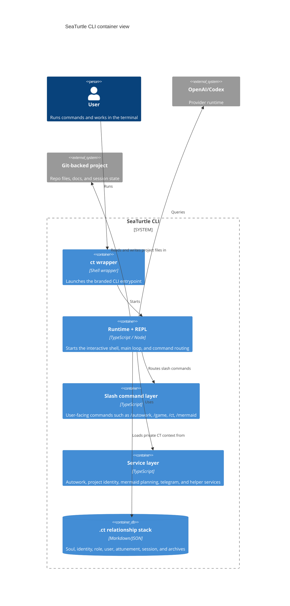

# C4 Container View

Container-level view of the main SeaTurtle runtime layers.

## Diagram

## Evidence

- entrypoint: source/src/entrypoints/cli.tsx
- entrypoint: source/src/main.tsx
- entrypoint: source/src/screens/REPL.tsx
- service: autowork
- service: projectIdentity
- service: mermaid

## Notes

- This focuses on top-level runtime pieces rather than every file.
- Mermaid C4 support is experimental.
