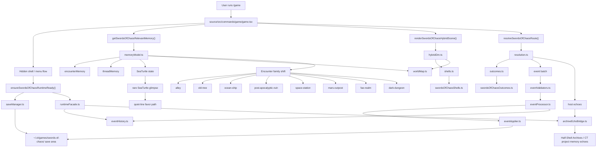

# Swords Of Chaos Architecture

This is the durable architecture map for the current embedded `Swords of Chaos`
runtime inside SeaTurtle.

It reflects the actual code path in this repo:

- host surface: `/game`
- embedded runtime: `source/src/services/swordsOfChaos/`
- save truth: local user-owned game state
- SeaTurtle: rare in-world presence, not the narrator

## Embedded Runtime Map

## Current Architecture Truths

- `game.tsx` is the host surface, not the game engine.
- `swordsOfChaos/` owns the game truth.
- local save state and event history are the canonical memory layer.
- only selected high-salience outcomes echo back into SeaTurtle archives.
- encounter progression is driven by:
  - canonized threads
  - encounter memory
  - rare SeaTurtle state
- the hybrid DM seam is bounded and deterministic right now:
  - runtime-owned shells
  - runtime-owned outcomes
  - runtime-owned event application

## Why This Matters

This structure keeps `Swords of Chaos` rich without muddying project-working
context, and it leaves a clean extraction path if the game ever becomes a
standalone runtime later.
