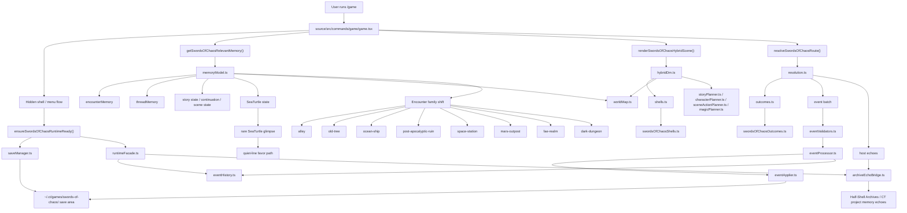

# Swords Of Chaos Architecture

This is the durable architecture map for the current embedded `Swords of Chaos`
runtime inside SeaTurtle.

It reflects the actual code path in this repo:

- host surface: `/game`
- embedded runtime: `source/src/services/swordsOfChaos/`
- save truth: local user-owned game state
- SeaTurtle: rare in-world presence, not the narrator

## Embedded Runtime Map

## Current Architecture Truths

- `game.tsx` is the host surface, not the game engine.
- `swordsOfChaos/` owns the game truth.
- local save state and event history are the canonical memory layer.
- the save truth now includes:
  - story chapter/objective/tension
  - continuation state
  - unfolding scene state
  - character development state
  - magical pressure state
- only selected high-salience outcomes echo back into SeaTurtle archives.
- encounter progression is driven by:
  - canonized threads
  - encounter memory
  - continuation and scene state
  - character development pressure
  - magical pressure
  - rare SeaTurtle state
- the hybrid DM seam is bounded and deterministic right now:
  - runtime-owned resolution and event truth
  - runtime-owned outcomes
  - runtime-owned event application
  - planner-owned scene action generation
  - planner-owned pacing and pressure shaping

## Current Planner Ownership

The present planner stack is:

- `storyPlanner.ts`
  - chapter advancement
  - objective and tension progression
  - carry-forward and continuation shaping
  - outcome variation framing
- `characterPlanner.ts`
  - character arc advancement
  - world-facing recognition, temptation, and payoff pressure
- `sceneActionPlanner.ts`
  - scene-native opening and second-beat action surfaces
- `magicPlanner.ts`
  - tracked uncanny escalation, omens, crossings, and impossible pressure

## Host Surface Responsibilities

`game.tsx` now owns:

- typed scene reveal pacing
- dealer's-choice dramatic beats
- continuation gating before the next real choice
- the compact journey panel that surfaces current arc, objective, aftermath,
  and active uncanny pressure

It does not own canon. It only presents canon generated and persisted by the
runtime.

## Why This Matters

This structure keeps `Swords of Chaos` rich without muddying project-working
context, and it leaves a clean extraction path if the game ever becomes a
standalone runtime later.
