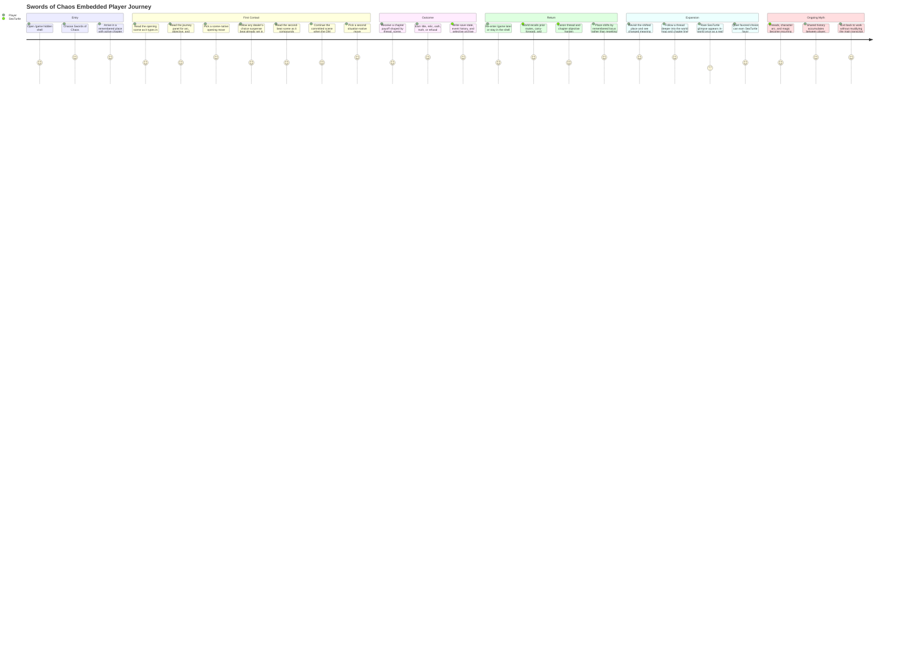

# Swords Of Chaos User Journey

This is the current player journey for `Swords of Chaos` as embedded inside
SeaTurtle.

The important product truth is that the player is not just replaying one scene.
They are moving through remembered places, hardening threads, and occasionally
drawing the attention of SeaTurtle as a rare in-world presence.

## Player Journey Map

## Current Journey Truths

- the game is accessed through `/game`, inside the hidden shell
- the current strong cycle is:
  - enter a remembered locus
  - read a typed opening scene
  - review a compact journey panel
  - choose a scene-native move
  - follow suspense beats if the committed action is still unfolding
  - choose again only when the DM surface says the next real decision is due
  - receive a chapter payoff that updates world, character, and magic state
  - return later to a changed place with changed pressure
- later cycles add:
  - callback biomes and active loci
  - canonized threads
  - carry-forward and continuation pressure
  - scene-state continuation
  - character development arcs
  - magical omens and crossings
  - recurring symbols
  - rare SeaTurtle presence
- the journey is meant to feel like:
  - remembered
  - slightly mythic
  - paced
  - compounding
  - lightweight to enter
  - richer on return
