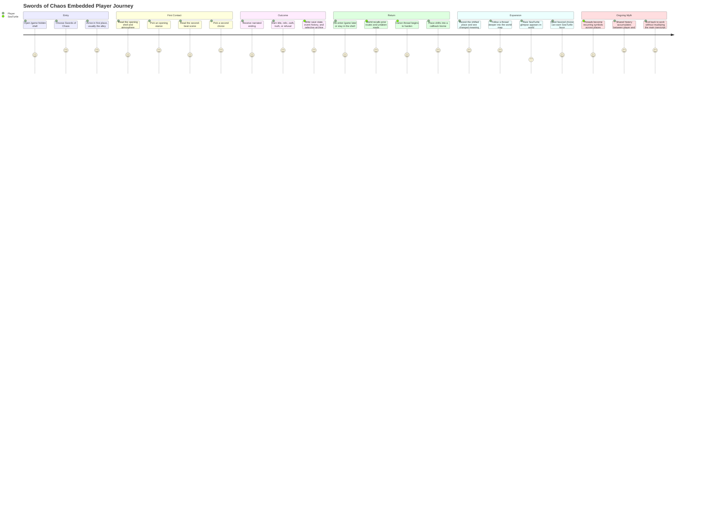

# Swords Of Chaos User Journey

This is the current player journey for `Swords of Chaos` as embedded inside
SeaTurtle.

The important product truth is that the player is not just replaying one scene.
They are moving through remembered places, hardening threads, and occasionally
drawing the attention of SeaTurtle as a rare in-world presence.

## Player Journey Map

## Current Journey Truths

- the game is accessed through `/game`, inside the hidden shell
- the first strong cycle is:
  - enter
  - choose stance
  - choose second beat
  - receive narrated outcome
  - return later to a changed place
- later cycles add:
  - callback biomes
  - canonized threads
  - recurring symbols
  - rare SeaTurtle presence
- the journey is meant to feel like:
  - remembered
  - slightly mythic
  - lightweight to enter
  - richer on return
