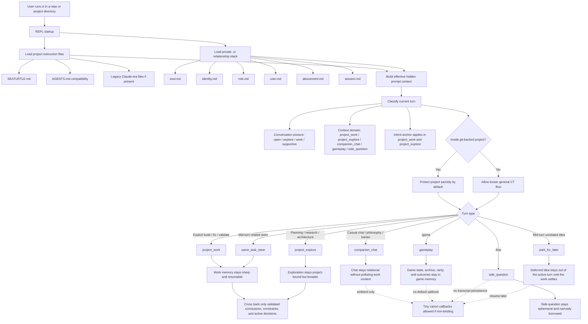

# CT Context Domains

This note defines how SeaTurtle should keep playful side experiences rich
without muddying active project work.

It is not user-facing copy.
It is an internal architecture note for context, memory, and intent hygiene.

## Why this matters

SeaTurtle should be:

- fun
- playful
- conversational
- surprising in good ways
- pleasant to spend long hours with

But project work should remain:

- sharp
- surgical
- coherent
- resumable
- protected from irrelevant spillover

Those are not conflicting goals.
They require context domain separation.

## Core principle

One interface. Multiple context domains.

Do not treat every turn as belonging to one undifferentiated running memory.

The user should experience a seamless CT.
The architecture should maintain meaningful boundaries underneath.

## Architecture map

This is the current architecture truth:

- `SEATURTLE.md` is the preferred shared project instruction file
- `AGENTS.md` is also read as a compatibility project-instructions file
- the `.ct/` relationship stack shapes CT continuously, but posture and domain
  classification stay lighter and more temporary
- git-root is the first protection heuristic for project sanctity
- `/btw` and `/game` are richer because they are separated, not blended into
  surgical work memory
- mid-turn steering is no longer only a timing queue; it is also a semantic
  routing layer
- the user should not have to do session math to keep CT on task

## Domain model

## Hidden steering lanes

SeaTurtle now treats mid-turn input as more than transport timing.

The hidden steering classifier can route incoming input as:

- `interrupt_now`
- `same_task_steer`
- `side_question`
- `park_for_later`

The intended behavior is:

- same-task input quietly steers the active work
- unrelated ideas do not hijack the active task
- unrelated ideas are parked and resumed after the active task chain settles
- `/btw` remains the explicit side-question lane

This is part of project sanctity.
It keeps active work sharper without forcing the user to manually route every
thought.

### `project_work`

Use for:

- implementation
- debugging
- testing
- validation
- code review
- file editing
- operational repo work

Properties:

- highest protection
- most resumable
- least tolerant of irrelevant noise
- should preserve working state, recent constraints, and active task intent

### `project_explore`

Use for:

- planning
- architecture
- research
- product thinking
- broad technical tradeoffs

Properties:

- still project-bound
- broader and looser than `project_work`
- can feed into `project_work`
- should not absorb unrelated game/chat debris

### `companion_chat`

Use for:

- casual conversation
- philosophy
- life talk
- banter
- reflective meandering

Properties:

- relational, not task-surgical
- should not pollute project-work context by default
- can coexist with CT identity, soul, attunement, and posture

### `gameplay`

Use for:

- `/game`
- collectible items
- rarity
- stats
- archive progression
- procedural encounters

Properties:

- should be rich and persistent in its own right
- should have its own memory and progression
- should not write into active project-work context
- can contribute small ambient canon callbacks, but not working-state debris

### `side_question`

Use for:

- `/btw`
- quick curiosity
- sidecar clarification
- ephemeral off-thread questions

Properties:

- ephemeral by default
- should borrow only what it truly needs
- should not automatically persist into project-working memory

## Git-root protection rule

If CT is operating inside a git-backed project, project sanctity should become
the default bias.

That means:

- protect `project_work` most aggressively
- do not let `/game`, `/btw`, or clearly non-work chat muddy that working context
- prefer separation unless the user explicitly promotes something back into the project thread

Git-root presence is the first heuristic, not the final one.
It is a practical starting point.

Additional rule:

- in a repo, not every conversation is about the repo
- determine intent from the message itself before promoting ambiguity into project guidance
- if the turn is playful, rhetorical, social, or meta, answer in that mode unless the user explicitly pivots into planning or execution

## Crossing policy

### Allowed to cross all domains

- soul
- identity
- role
- attunement
- user context

These define SeaTurtle, not a specific task thread.

### Allowed to cross from `project_explore` into `project_work`

- refined plans
- validated research conclusions
- active constraints
- intent anchor updates
- explicit user decisions

### Allowed to cross from `project_work` into `project_explore`

- current blockers
- relevant repo facts
- unresolved tradeoffs
- open validation questions

### Not allowed to cross into `project_work` by default

- gameplay transcript
- `/game` rewards as active task context
- casual banter
- philosophical drift
- `/btw` chatter
- non-work chat turns

### Rare ambient exceptions

Allowed as tiny ambient callback only if they do not muddy work:

- an archive line
- a light disposition callback
- a subtle canon reference

These must stay small and non-binding.

## Intent is not memory

Memory records what happened.
Intent captures what the user is actually trying to do.

SeaTurtle needs both.

Without an intent surface, the system can solve the wrong problem cleanly and
still miss what the user meant.

The architecture should preserve:

- the user's goal
- the user's constraints
- the user's desired feel or outcome
- obvious signs of wrong fit

Intent should be compact and revisable.
It should not be a second transcript.

## Design guidance

- preserve the sanctity of project work
- keep non-work domains rich by letting them stay distinct
- do not over-harden boundaries into something brittle and joyless
- do not flatten intent into checklists
- allow the user to experience one coherent SeaTurtle while the system quietly keeps its rooms in order

## Immediate implications

1. `/btw` should become more isolated than it is now
2. `/game` should evolve richer memory without polluting project work
3. intent should become a first-class comparison surface
4. git-backed sessions should get cleaner by default

This note is the architectural base for that wave.
